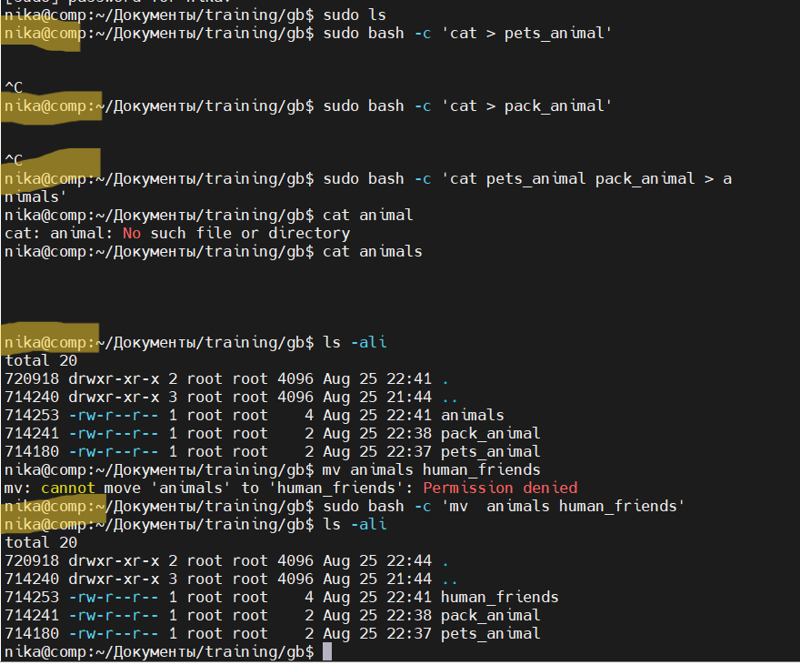
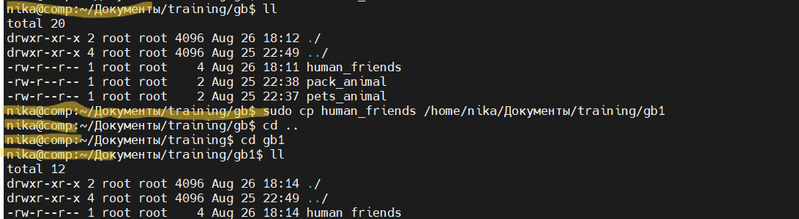
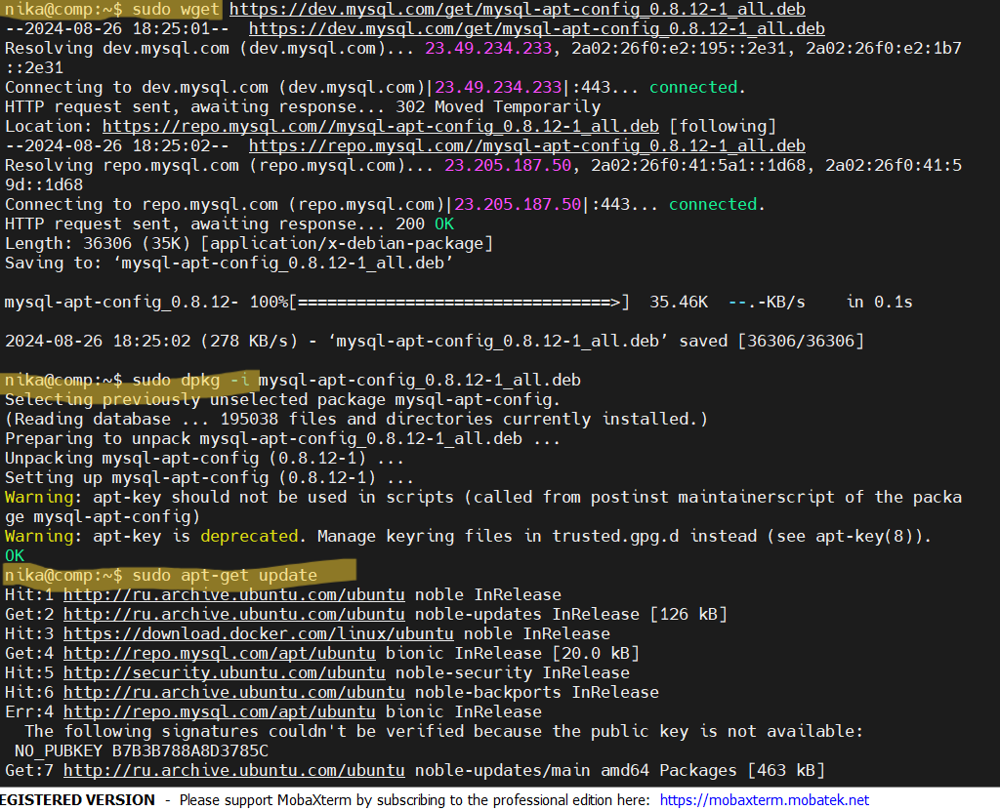
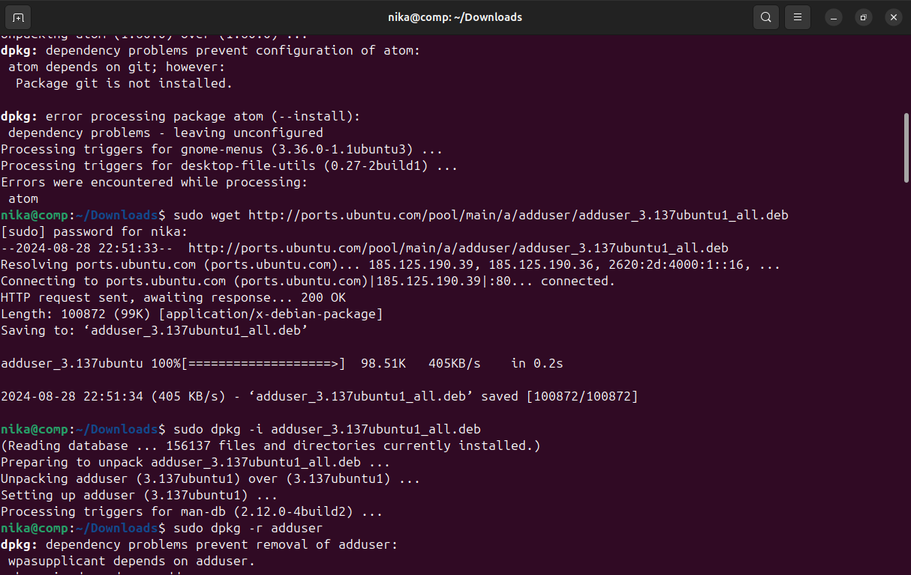
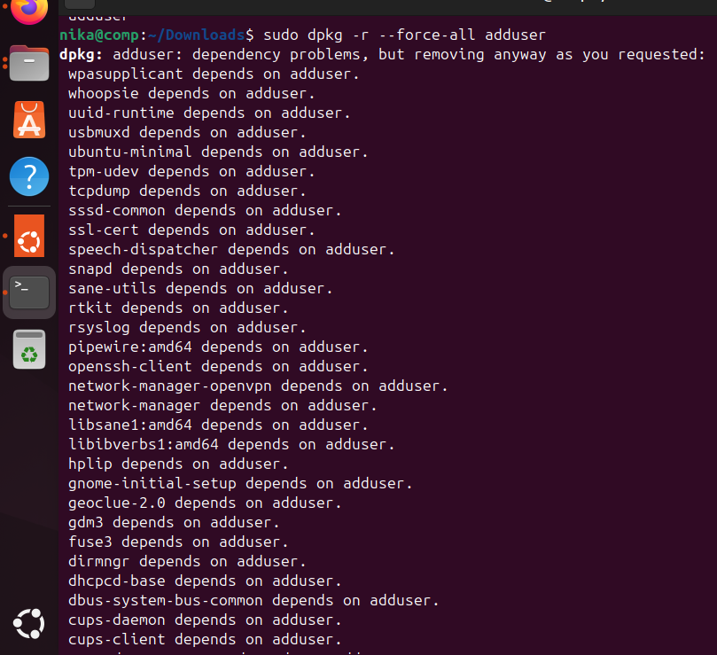
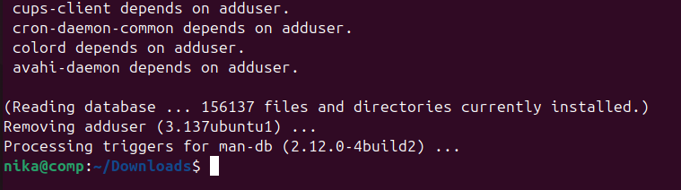
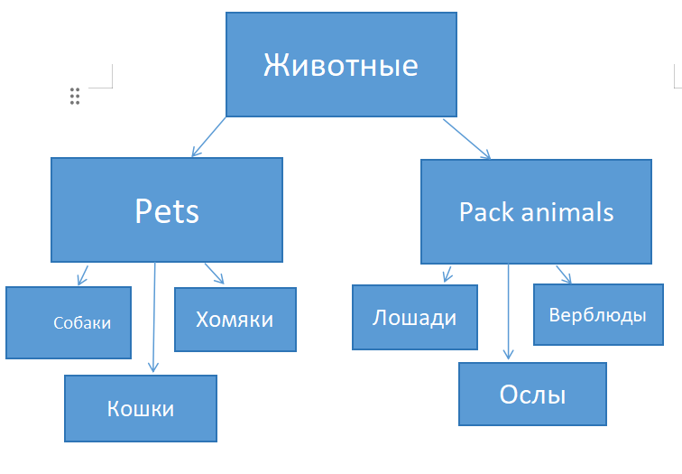

# workForHalfAYearGB
#### Необходимо организовать систему учета для питомника в котором живут домашние и Pack animals.

## Linux
1.Использование команды cat в Linux

2. Работа с директориями в Linux
* Создать новую директорию и переместить туда файл "Human Friends".

3. Работа с MySQL в Linux. “Установить MySQL на вашу вычислительную машину ”

* Подключить дополнительный репозиторий MySQL и установить один из пакетов из этого репозитория.

4. Управление deb-пакетами

- Установить и затем удалить deb-пакет, используя команду `dpkg`.

## Установка:

## Удаление:

5. [История команд](https://github.com/VeronikaKhodan21/workForHalfAYearGB/blob/main/HistoryCommandsUbuntu.md) из терминала Ubuntu

## ООП
6. Диаграмма классов

7. Подробно про задание читайте [тут](https://github.com/VeronikaKhodan21/workForHalfAYearGB/blob/main/sql/animalFriends.sql)
 
## ООП И JAVA

9. И 10.
- Программа-реестр домашних животных
- Чтобы запустить код нужно скомпилировать [файл src/Main.java]()
- Все данные про животных храняться в [nursery/Nursery.txt](), но файл в байтах поэтому вы ничего не прочитается
- Так же я добавила сортировку по разным критериям
- Чтобы работать с реестром сначало нужно его прочитать !!!ЭТО ВАЖНО!!!
