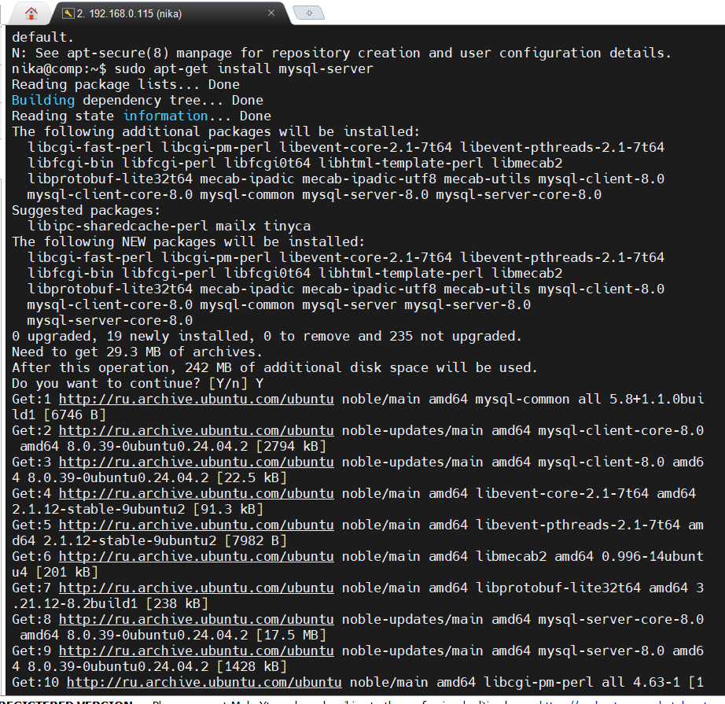

# workForHalfAYearGB
1.Использование команды cat в Linux

2. Работа с директориями в Linux
* Создать новую директорию и переместить туда файл "Human Friends".

3. Работа с MySQL в Linux. “Установить MySQL на вашу вычислительную машину ”

* Подключить дополнительный репозиторий MySQL и установить один из пакетов из этого репозитория.

